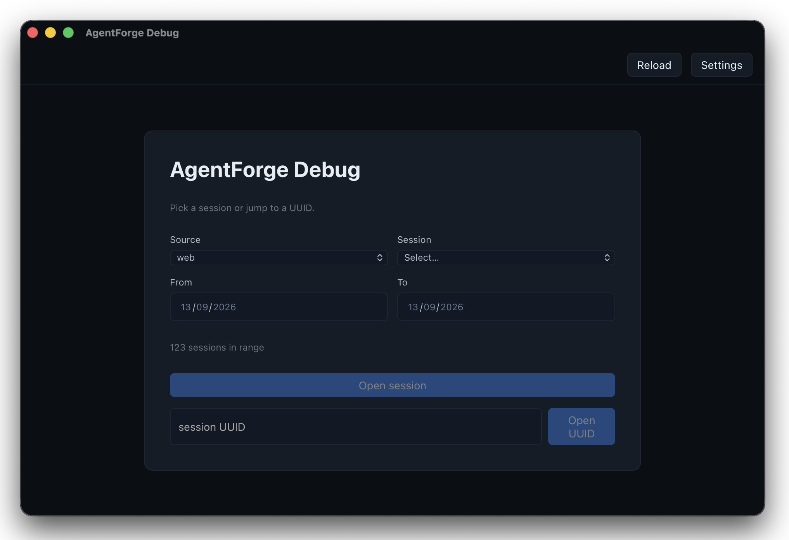
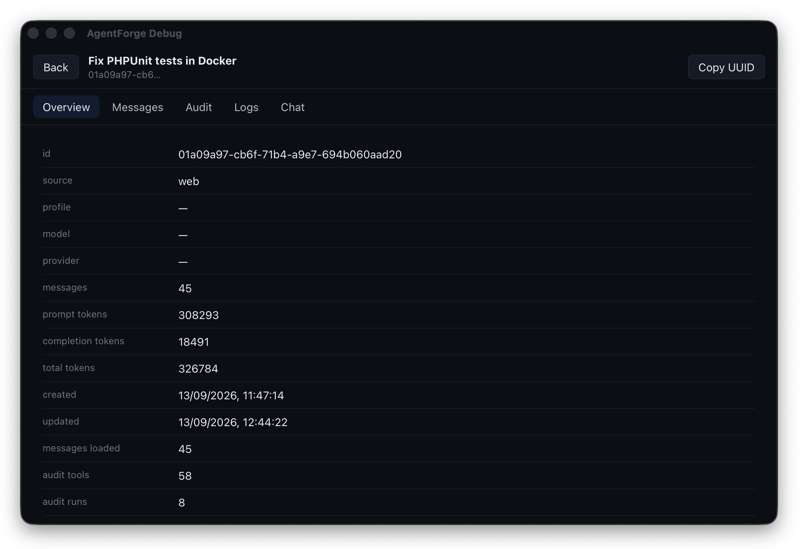
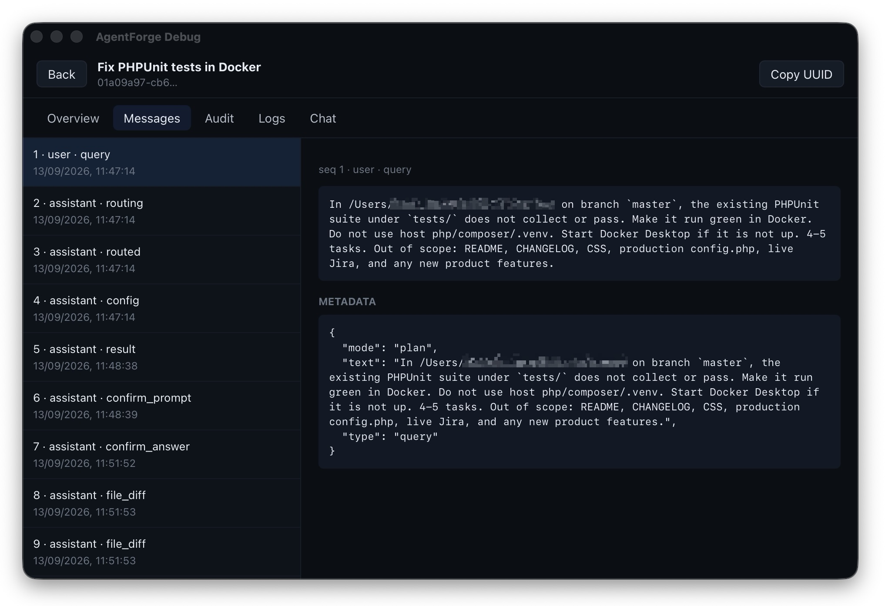
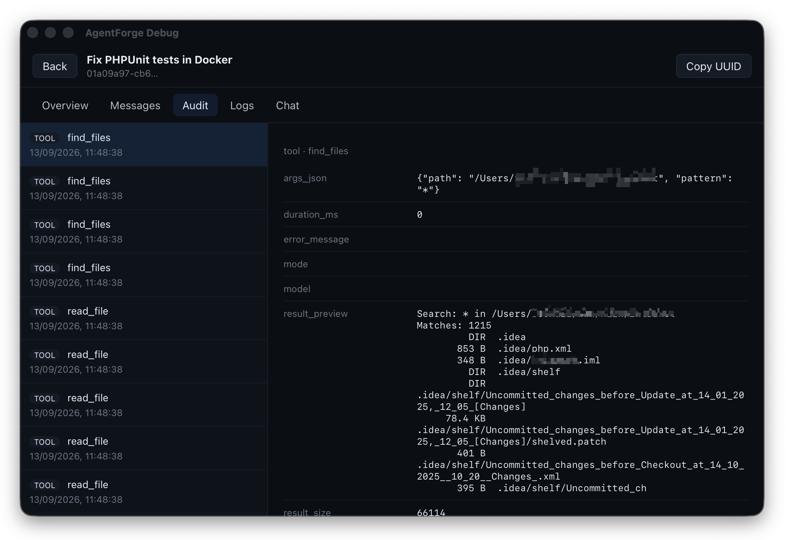
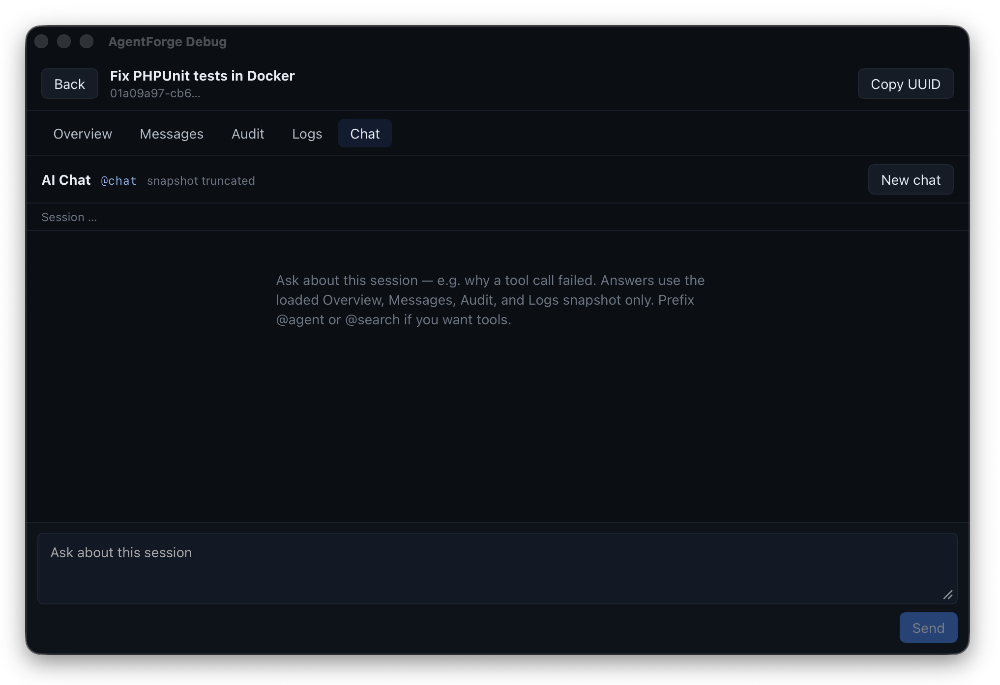
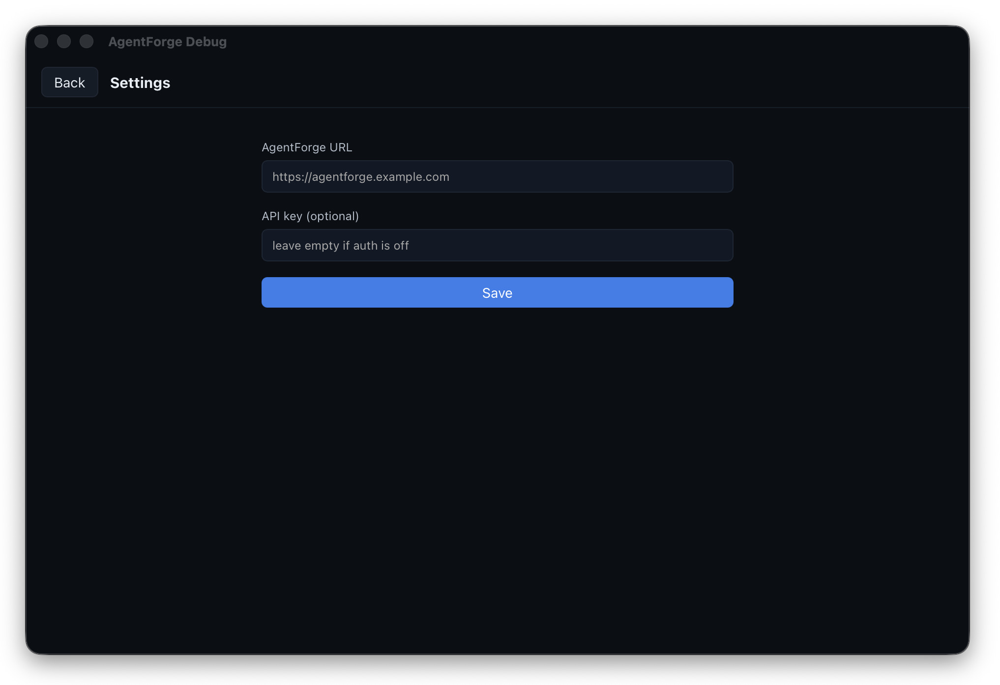

# AgentForge Debug

[](https://github.com/bulletinmybeard/agent-forge-debug/actions/workflows/ci.yml)
[](./LICENSE)
[](https://nodejs.org/)
[](https://www.typescriptlang.org/)
[](https://vitejs.dev/)
[](https://react.dev/)
[](https://v2.tauri.app/)
[](https://biomejs.dev/)
[](https://github.com/bulletinmybeard/agent-forge/releases/tag/v0.16.0)

Native macOS inspector for [AgentForge](https://github.com/bulletinmybeard/agent-forge) chat sessions. Pick a session (or jump to a `UUID`), then read **Overview**, **Messages**, **Audit**, and **Loki** logs (*optional). The Chat tab asks AgentForge about the snapshot over `/ws/chat`.

This app is a live `HTTP/WebSocket` client of an AgentForge instance. It does not store sessions locally.

> [!IMPORTANT]
> **Backend version:** AgentForge Debug needs [AgentForge **v0.16.0**](https://github.com/bulletinmybeard/agent-forge/releases/tag/v0.16.0) or newer.
> The session picker, `GET /api/debug/sessions/{id}` (Overview, Messages, Audit, Logs), and Chat over `/ws/chat` all talk to that backend. Older instances will fail those endpoints (e.g. 404).

## Requirements

- macOS 11+
- Node.js 20+
- Rust (stable) and Cargo — needed for the Tauri shell
- A running [AgentForge](https://github.com/bulletinmybeard/agent-forge) backend **[v0.16.0](https://github.com/bulletinmybeard/agent-forge/releases/tag/v0.16.0) or newer** that exposes the debug API

## Setup

```bash
npm install
npm run tauri dev
```

Open **Settings** and set:

- **AgentForge URL** — origin only, no trailing slash (example: `https://agentforge.example.com`)
- **API key** — optional Bearer token; leave empty if the instance does not require auth

Settings are written to the Tauri app config dir as `settings.json` (not in this repo).

## Usage

1. **Picker** — filter by source and date, select a session, or paste a UUID.
2. **Overview** — session metadata, token counts, load errors.
3. **Messages** — list + detail for content, metadata, and tool calls.
4. **Audit** — tool and run records.
5. **Logs** — Loki lines with host / job / text filters.
6. **Chat** — a separate AgentForge session (`source=debug`) with the snapshot attached on the first message.

Reload the list from the picker. Copy the UUID from the session page.

## Screenshots

<table>
  <tr valign="top">
    <td width="33%">
      <a href="docs/assets/agent-forge-debug-start-page.jpg">
        
      </a>
    </td>
    <td width="33%">
      <a href="docs/assets/agent-forge-debug-overview.jpg">
        
      </a>
    </td>
    <td width="33%">
      <a href="docs/assets/agent-forge-debug-messages.jpg">
        
      </a>
    </td>
  </tr>
  <tr>
    <td align="center"><em>Pick a session or jump to a UUID</em></td>
    <td align="center"><em>Overview of the loaded snapshot</em></td>
    <td align="center"><em>Messages, metadata, tool calls</em></td>
  </tr>
  <tr valign="top">
    <td width="33%">
      <a href="docs/assets/agent-forge-debug-audit.jpg">
        
      </a>
    </td>
    <td width="33%">
      <a href="docs/assets/agent-forge-debug-ai-chat.jpg">
        
      </a>
    </td>
    <td width="33%">
      <a href="docs/assets/agent-forge-debug-settings.jpg">
        
      </a>
    </td>
  </tr>
  <tr>
    <td align="center"><em>Audit tools and runs</em></td>
    <td align="center"><em>Ask about this session</em></td>
    <td align="center"><em>URL and optional API key</em></td>
  </tr>
</table>

## AgentForge API

The desktop app calls:

| Method | Path | Purpose |
|--------|------|---------|
| GET | `/api/sessions?source={source}&limit=200` | Session picker |
| GET | `/api/debug/sessions/{id}` | Debug bundle (session, messages, audit, logs) |
| WebSocket | `/ws/chat?source=debug` | Chat tab |

Auth is `Authorization: Bearer <api_key>` on HTTP, and the same key as a WebSocket subprotocol when set.

## License

MIT. See [LICENSE](LICENSE).
